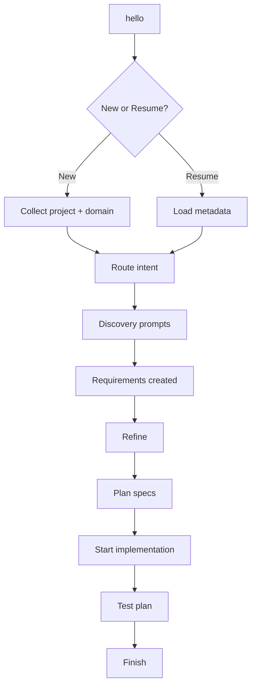
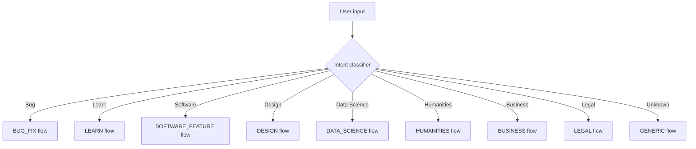
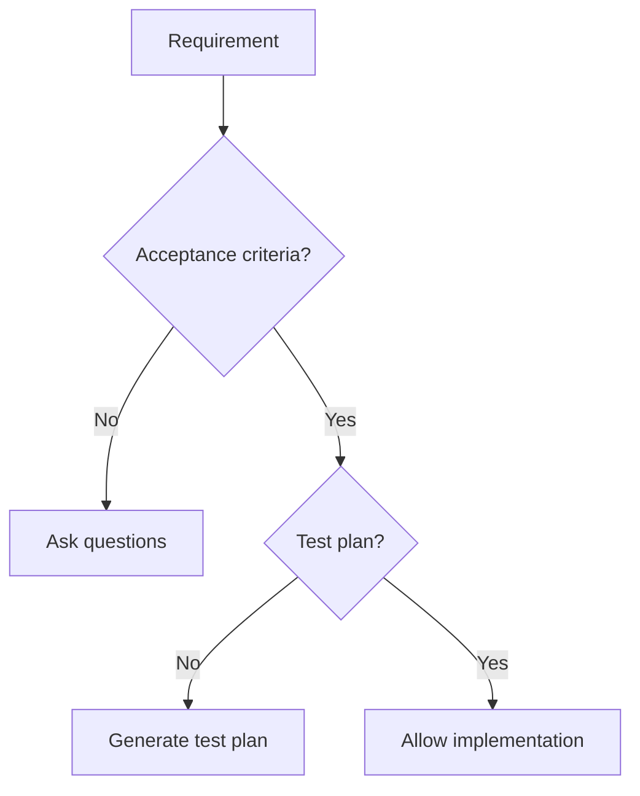

# Diagrams (text-based)

These diagrams describe the system behavior and are intended for Mermaid or PlantUML.

## High-level flow

## Router decision

## Gate checks

## Diagram templates

Template files live in `templates/diagrams/`:
- `context.mmd`
- `container.mmd`
- `component.mmd`

Example diagrams live in `examples/diagrams/`.
